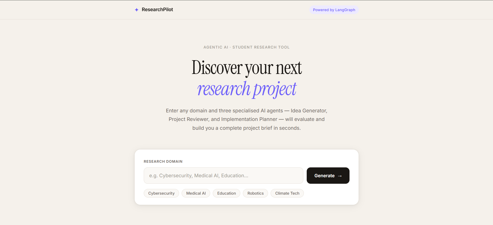
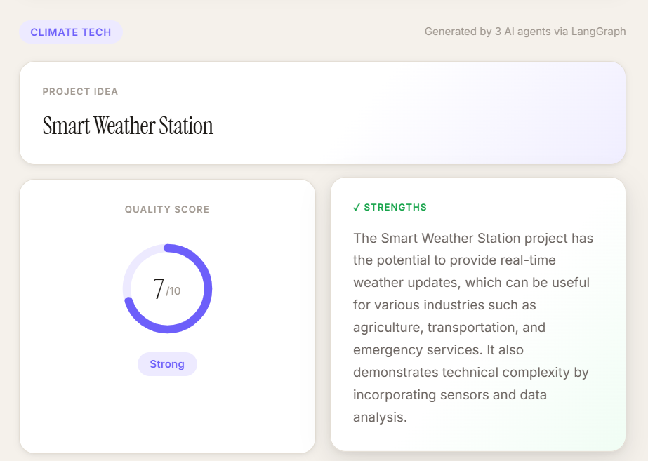

# 🚀 ResearchPilot

<div align="center">

### 🤖 AI-Powered Multi-Agent Research Assistant

Transform a simple research domain into a complete project idea, evaluation report, and implementation roadmap using Agentic AI.

<br>


---

### 🌐 Live Application

🔗 **Frontend:** https://research-pilot-gilt.vercel.app

🔗 **Backend API:** https://research-pilot-jhb9.onrender.com

🔗 **API Docs:** https://research-pilot-jhb9.onrender.com/docs

</div>

---

# 📖 The Story Behind ResearchPilot

As an engineering student, one problem kept appearing again and again.

Whenever a project submission, hackathon, research paper, or innovation challenge arrived, the hardest part was never coding.

The hardest part was:

* Finding a good project idea
* Understanding whether the idea was actually useful
* Knowing if the idea was too simple or too ambitious
* Creating a roadmap to build it

Most students spend hours searching YouTube, GitHub, Google, and ChatGPT trying to answer these questions.

I wanted to automate this entire process.

Instead of using a single AI prompt, I decided to build an **Agentic AI Workflow** where multiple specialized AI agents collaborate together.

This resulted in **ResearchPilot**.

A platform where users enter a domain such as:

```text
Cybersecurity
Medical AI
Education
Agriculture
FinTech
```

and instantly receive:

✅ A project idea

✅ A quality score

✅ Strengths and weaknesses

✅ A complete implementation roadmap

all generated through a multi-agent architecture powered by LangGraph.

---

# ✨ What ResearchPilot Does

ResearchPilot acts like a virtual research mentor.

It takes a domain as input and automatically:

### 🎯 Generates a Project Idea

Example:

```text
Input:
Medical AI

Output:
AI-Powered Medical Diagnosis System
```

---

### 🧠 Reviews the Idea

The Reviewer Agent evaluates:

* Innovation
* Practicality
* Complexity
* Industry relevance

and produces:

```text
Score: 8/10
```

along with strengths and weaknesses.

---

### 🗺️ Creates an Implementation Plan

Example:

```text
1. Collect Dataset
2. Build AI Model
3. Train & Evaluate
4. Create Interface
5. Integrate Components
6. Deploy Application
```

---

# 📸 Screenshots

## 🏠 Landing Page



---

## 🤖 Generated Research Project



---


# 🏗️ System Architecture

```text
                   User
                     │
                     ▼

          ┌───────────────────┐
          │     Frontend      │
          │ HTML • CSS • JS   │
          └─────────┬─────────┘
                    │
                    ▼

          ┌───────────────────┐
          │      FastAPI      │
          │   REST Backend    │
          └─────────┬─────────┘
                    │
                    ▼

          ┌───────────────────┐
          │     LangGraph     │
          │ Agent Workflow    │
          └─────────┬─────────┘
                    │
      ┌─────────────┼─────────────┐
      ▼             ▼             ▼

┌───────────┐ ┌───────────┐ ┌───────────┐
│ Generator │ │ Reviewer  │ │ Planner   │
│  Agent    │ │  Agent    │ │  Agent    │
└───────────┘ └───────────┘ └───────────┘

                    │
                    ▼

          Structured JSON Output
```

---

# 📂 Project Structure

```bash
ResearchPilot
│
├── backend
│   │
│   ├── graphs
│   │   └── research_graph.py
│   │
│   ├── models
│   │   ├── project_idea.py
│   │   ├── project_review.py
│   │   ├── implementation_plan.py
│   │   └── request_models.py
│   │
│   ├── idea_generator.py
│   ├── project_reviewer.py
│   ├── implementation_planner.py
│   ├── main.py
│   └── requirements.txt
│
├── frontend
│   ├── index.html
│   ├── style.css
│   └── script.js
│
├── docs
│   ├── home.png
│   ├── result.png
│   └── api-docs.png
│
└── README.md
```

---

# ⚙️ Tech Stack

## Backend

* Python
* FastAPI
* LangChain
* LangGraph
* Pydantic
* Groq API

---

## Frontend

* HTML5
* CSS3
* JavaScript (Vanilla)

---

## Deployment

* Vercel
* Render
* GitHub

---

# 🚀 Key Features

### 🤖 Multi-Agent AI Workflow

Three AI agents collaborate to produce better outputs.

---

### 📊 Project Evaluation

Automatically scores project ideas.

---

### 📝 Strength & Weakness Analysis

Provides realistic project feedback.

---

### 🗺️ Implementation Planning

Generates actionable development roadmaps.

---

### ⚡ Fast API Response

Powered by Groq's high-speed inference.

---

### 🌐 Full-Stack Deployment

Accessible from anywhere through public cloud deployment.

---

# 🛠️ Installation Guide

## Clone Repository

```bash
git clone https://github.com/adri-chak/ResearchPilot.git

cd ResearchPilot
```

---

## Backend Setup

```bash
cd backend

python -m venv venv
```

Activate environment:

### Windows

```bash
venv\Scripts\activate
```

### Install Dependencies

```bash
pip install -r requirements.txt
```

---

## Create Environment Variables

Create:

```bash
.env
```

Add:

```env
GROQ_API_KEY=YOUR_API_KEY
```

---

## Run Backend

```bash
uvicorn main:app --reload
```

Backend:

```text
http://localhost:8000
```

Swagger Docs:

```text
http://localhost:8000/docs
```

---

## Run Frontend

Open:

```text
frontend/index.html
```

using VS Code Live Server.

---

# 📌 Example API Request

```json
{
  "domain": "Education"
}
```

---

# 📌 Example Response

```json
{
  "domain": "Education",
  "idea": "AI-Powered Adaptive Learning System",
  "score": 8,
  "strengths": "...",
  "weaknesses": "...",
  "plan": [
    "Define learning objectives",
    "Build AI model",
    "Develop interface",
    "Deploy platform"
  ]
}
```

---

# 🎓 What I Learned

Through this project I learned:

* Agentic AI concepts
* LangGraph workflows
* State management in AI systems
* Structured LLM outputs
* API development using FastAPI
* Cloud deployment
* Frontend-backend integration
* Production debugging (CORS, deployment issues)

---

# 🔮 Future Improvements

* PDF Research Report Generator
* Research Paper Finder Agent
* RAG-based Literature Review
* Vector Database Integration
* User Authentication
* Project History Dashboard
* Research Collaboration Features

---

# 📜 License

This project is licensed under the MIT License.

You are free to use, modify, and distribute this software for educational and commercial purposes.

For more information see the LICENSE file.

---

<div align="center">

### ⭐ If you found this project useful, consider giving it a star!

Built with ❤️ using FastAPI, LangGraph, LangChain and Groq.

</div>
